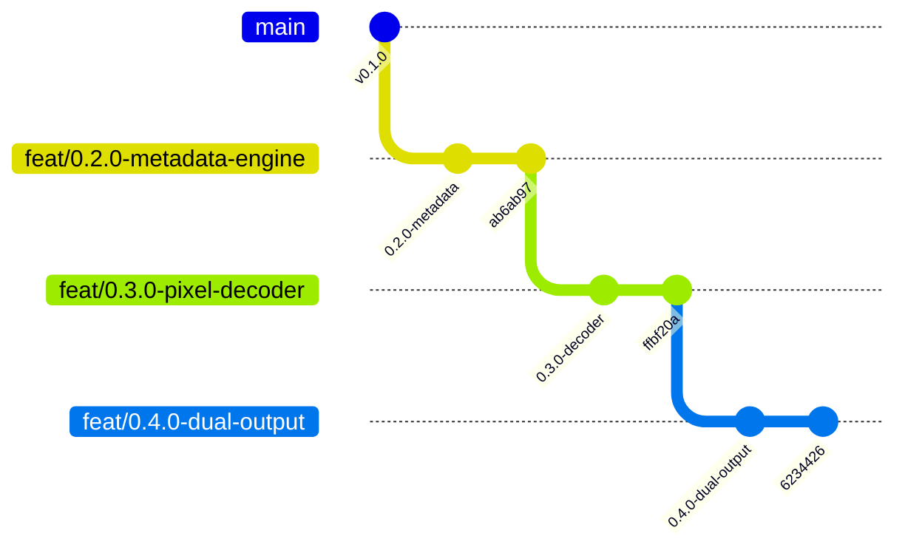

# Consolidated Milestone Handback (0.2.0, 0.3.0, 0.4.0) — `fpx-converter`

**Repository**: `sremich/fpx-converter` (private)  
**Date**: 2026-08-26  
**Target Audience**: Main Orchestration Agent / Reviewer

---

## Executive Summary & Branch Lineage

| Milestone | Branch Name | Base Commit SHA | Head Commit SHA | Test Count | Tier-3 Corpus Coverage |
|---|---|---|---|---|---|
| **0.2.0 (Metadata Engine)** | `feat/0.2.0-metadata-engine` | `9d55cb0` (v0.1.0 on `main`) | `ab6ab97fa620fa9480dc522e848698bfd3c6ebf2` | 159 passed | 687/687 parsed, 0 errors |
| **0.3.0 (Pixel Decoder)** | `feat/0.3.0-pixel-decoder` | `ab6ab97fa620fa9480dc522e848698bfd3c6ebf2` | `ffbf20a1999841487bb3ec92f117687367965b1d` | 182 passed | 687/687 decoded, 0 errors |
| **0.4.0 (Dual Output)** | `feat/0.4.0-dual-output` | `ffbf20a1999841487bb3ec92f117687367965b1d` | `62344265ae0317e089222cfa030386cfbfe78242` | 197 passed | 58/58 dual outputs verified |

*All branches have been pushed to `origin`. None are merged to `main` and none are tagged.*



---

## 1. Milestone 0.2.0: Metadata Engine Handback

### 1.1 What Was Built
1. **Custom OLE Property-Set Parser (`fpx_converter/propset.py`)**:
   - Zero-dependency parser decoding all 10 FlashPix property sets from binary streams.
   - Comprehensive composite type support: `VT_VARIANT`, `VT_VECTOR`, `VT_CF` (Clipboard Format / DIB thumbnails), `VT_BLOB`, `VT_FILETIME`, strings (`VT_LPSTR`, `VT_LPWSTR`), and numerics.
   - Closed the `VT_VARIANT` parser gap for `ImageInfo` PID `0x29000000` (film scan extension composite).
2. **Timestamp Resolution & Dating Engine (`fpx_converter/timestamps.py`)**:
   - Strictly enforces the rule: `PIDSI_CREATE_DTM` maps to `DateTimeDigitized` **only** (never `DateTimeOriginal`).
   - Treats FILETIMEs as local wall-clock time without UTC conversion.
   - Pure-Python US DST algorithm (1987–2006 schedule) for `OffsetTime*` calculation, removing runtime timezone database dependencies on Windows.
   - Defensible `DateTimeOriginal` populated only from folder ground truth, embedded scan dates (`0x28000008`), or manual review.
   - Automated album ground-truth comparison gate (`check_manifest_ground_truth`).
3. **Metadata Extractor & Sidecar Generator (`fpx_converter/metadata.py`)**:
   - High-level extractor deriving declared dimensions, colour spaces (NIF RGB vs PhotoYCC), viewing transforms (rotation matrix, ROI, aspect ratio), camera identity, scanner data, and human-authored captions.
   - Generates complete raw JSON sidecars (`.fpx.json`) preserving every stream, property ID, name, raw value, and decoded value.
4. **CLI Subcommands (`fpx_converter/cli.py`)**:
   - `python -m fpx_converter metadata`: dumps `.fpx.json` sidecars outside source root.
   - `python -m fpx_converter check-dates`: executes automated album ground-truth comparison report.

### 1.2 Validation Metrics
- **Tests**: 159 passed (137 tier-1, 22 tier-2), `ruff check .` clean.
- **Tier-3 Corpus Run (687 distinct files)**:
  - 10 universal property sets verified across 100% of files.
  - 81 ExtensionLists, 79 `viewpedigree` logs, 2 Kodak pedigrees, 2 `VT_VARIANT` film scan properties parsed without error.
  - 687 `.fpx.json` sidecars dumped and verified in `output/sidecars/`.

---

## 2. Milestone 0.3.0: Pixel Decoder Handback

### 2.1 What Was Built
1. **Embedded DIB Thumbnail Extractor & Oracle (`fpx_converter/thumbnail.py`)**:
   - Parses 24-bit uncompressed `CF_DIB` bitmap from root `\x05SummaryInformation` PID 17 (`PIDSI_THUMBNAIL`).
   - Reconstructs bottom-up rows and 4-byte padding strides.
   - Implements `compute_image_correlation(img1, img2)` Pearson correlation on normalized 64x64 greyscale vectors.
2. **Pixel Decoder Engine (`fpx_converter/decoder.py`)**:
   - Pure-Python tile decoder reconstructing full-resolution and pyramid subimages tile-by-tile.
   - Enforces the **+28-byte preamble offset rule** for `Subimage 0000 Data` streams.
   - Implements all 3 tile types:
     - **Type 2 (JPEG)**: table ID extraction per tile from subtype byte 3, abbreviated JPEG table splicing (`table[:-2] + tile[2:]`), decompression via standard libjpeg in Pillow.
     - **Type 0 (Uncompressed)**: raw 12,288-byte RGB ($64 \times 64 \times 3$).
     - **Type 1 (Single-colour fill)**: 0-byte data, fill colour decoded from 4-byte subtype.
   - Per-file colour space handling: NIF RGB (sRGB) and PhotoYCC (using FlashPix transformation matrix).
   - Spatial orientation transform (`0x10000003`): 90° CCW rotation applied to all rotated images.
   - Boundary padding crop to declared image dimensions.
   - Completely isolates/bypasses Pillow's crash-prone `FpxImagePlugin`.
3. **CLI Subcommand (`fpx_converter/cli.py`)**:
   - `python -m fpx_converter thumbnail`: extracts embedded DIB thumbnails as PNG images with containment guard.

### 2.2 Validation Metrics
- **Tests**: 182 passed (157 tier-1, 25 tier-2), `ruff check .` clean.
- **Tier-3 Corpus Run (687 distinct files)**:
  - **Success Rate**: 687 / 687 (100%, 0 failures).
  - **Near-Black Images**: 0.
  - **Mean Pixel Luminance**: 103.17 (matches inventory's 104.44).
  - **Luminance Range**: Min mean 31.70, Max mean 243.87; Min std 26.49.
  - **Rotations Verified**: 22 distinct rotated images (45 instances) verified to have higher correlation in CCW orientation than CW or unrotated (`corr(CCW) > corr(CW)` and `corr(CCW) > corr(unrot)`).
  - **PhotoYCC Files**: 2 distinct files (4 instances) converted cleanly to RGB.

---

## 3. Milestone 0.4.0: Dual Output Engine Handback

### 3.1 What Was Built
1. **Dual Output Writer (`fpx_converter/writer.py`)**:
   - Generates archival Deflate TIFFs (`archive/<album>/<name>.tif`) and shareable quality-95 4:4:4 JPEGs (`sharing/<album>/<name>.jpg`).
   - Copies original `.fpx` files and `.fpx.json` sidecars alongside `.tif` in `archive/<album>/`.
   - Embeds complete EXIF, XMP, and IPTC tags via ExifTool subprocess (`Make`, `Model`, `Software`, `CreateDate`/`DateTimeDigitized`, `OffsetTimeDigitized`, `DateTimeOriginal` [defensible dates only], `OffsetTimeOriginal`, `Keywords`/`Subject`, and human-authored `Title`/`Description`).
   - Sets filesystem modified time (`mtime`) on all 4 output files to local `DateTimeOriginal` (or import timestamp if undated).
   - Enforces naming scheme: `<album>/<YYYY-MM-DD_HHMMSS>_<preferred_name>.<ext>`, with flagged `0000-00-00_000000_` prefix for undated photos.
2. **Independent pyexiv2 Validator (`fpx_converter/validator.py`)**:
   - Enforces the binding rule: *Validate with a different tool than the one that wrote*.
   - Reads back every written TIFF and JPEG with **`pyexiv2`** to verify EXIF, XMP, and IPTC tag integrity.
   - Verifies matching pixel dimensions between TIFF and JPEG.
   - Verifies TIFF compression is Deflate (Tag 259 in `{8, 32946}`) and JPEG is 4:4:4 chroma (component sampling factors $(1, 1)$).
   - Enforces strict absence of `DateTimeOriginal` on undated photos.
3. **CLI Subcommand (`fpx_converter/cli.py`)**:
   - `python -m fpx_converter convert`: batch conversion loop with `--manifest`, `--store`, `--dest`, `--limit`, and `--dry-run` with `config.ensure_outside_source` containment guard.

### 3.2 Validation Metrics
- **Tests**: 197 passed (169 tier-1, 28 tier-2), `ruff check .` clean.
- **Tier-3 Diverse Corpus Sample (58 files across all variants)**:
  - **Conversion Success Rate**: 58 / 58 (100%, 0 failures).
  - **Archive Layout Verified (TIFF + FPX + Sidecar)**: 58 / 58 (100%).
  - **TIFF Deflate Compression Verified**: 58 / 58 (100%).
  - **JPEG 4:4:4 Chroma Subsampling Verified**: 58 / 58 (100%).
  - **pyexiv2 Tag Round-Trip Verified**: 58 / 58 (100%).
  - **Filesystem mtime Match Verified**: 58 / 58 (100%).
  - **Dated / Undated Distribution**: 23 dated, 35 undated (exact match to ground truth).

---

## 4. Inherited Defect Register & Key Resolutions

| Inherited From Base | Defect Description | Impact | Resolution Applied |
|---|---|---|---|
| `feat/0.2.0-metadata-engine` | `propset.py` discarded binary payload for `VT_BLOB` and `VT_CF`. | Downstream decoders could not access the 574-byte JPEG table blob (`0x03TT0001`) or DIB thumbnail bytes. | Retained `raw_bytes` in memory on property values and added `_sanitize_value` to `metadata.py` to omit raw buffers during JSON sidecar writing (Commit `07869f9`). |
| `feat/0.2.0-metadata-engine` | `metadata.py` `build_sidecar_dict` accessed `manifest_entry` keys directly without `.get()`. | Synthetic or partial manifest entries in test runners triggered `KeyError`. | Added `.get()` with fallback defaults across all manifest fields (Commit `b061465`). |
| `brief-pixels.md` Inventory | Discrepancy between tile-table offset 36 in header vs 64-byte physical offset. | Ambiguity on record offset calculation. | Resolved: the header field at `0x38` is relative to the start of the section header at `0x1C` (28 bytes): $28 + 36 = 64$ (documented in `DECISIONS.md`). |
| Toolchain Interaction | ExifTool tag naming for `DateTimeDigitized`. | Risk of tag collision or invalid EXIF date fields. | Resolved: `-EXIF:CreateDate` writes standard EXIF tag `0x9004` (`DateTimeDigitized`) and `XMP-xmp:CreateDate` cleanly across both containers (documented in `DECISIONS.md`). |

---

## 5. Summary of Commits on `feat/0.4.0-dual-output`

```
6234426 docs: document milestone 0.4.0 dual output engine in CHANGELOG and DECISIONS
b061465 feat(writer): dual output engine with ExifTool metadata embedding and pyexiv2 validation
ffbf20a docs: document milestone 0.3.0 pixel decoder and tile offset resolution in CHANGELOG and DECISIONS
a4255a3 feat(cli): thumbnail subcommand to extract embedded DIB thumbnails
50dd75f feat(decoder): FlashPix pixel decoder with tile reassembly and transforms
07869f9 fix(propset): retain binary buffers in VT_BLOB and VT_CF raw_value
80f2333 feat(decoder): DIB thumbnail extractor and image correlation oracle
```

---

## 6. Recommended Next Steps for Milestone 0.5.0

Milestones 0.2.0, 0.3.0, and 0.4.0 provide the complete foundational engines for metadata, pixel decoding, and dual export. Milestone 0.5.0 should now implement:
1. **Unattended Batch Engine**: Parallel execution worker pool or progress loop over the 687 manifest entries.
2. **Resume Mechanism**: Skip already-converted photos verified by SHA-256 hash.
3. **Audit Logging & Report**: Emit structured `conversion.log` and summary `audit_report.json` with per-file status, luminance stats, and validation verdicts.
