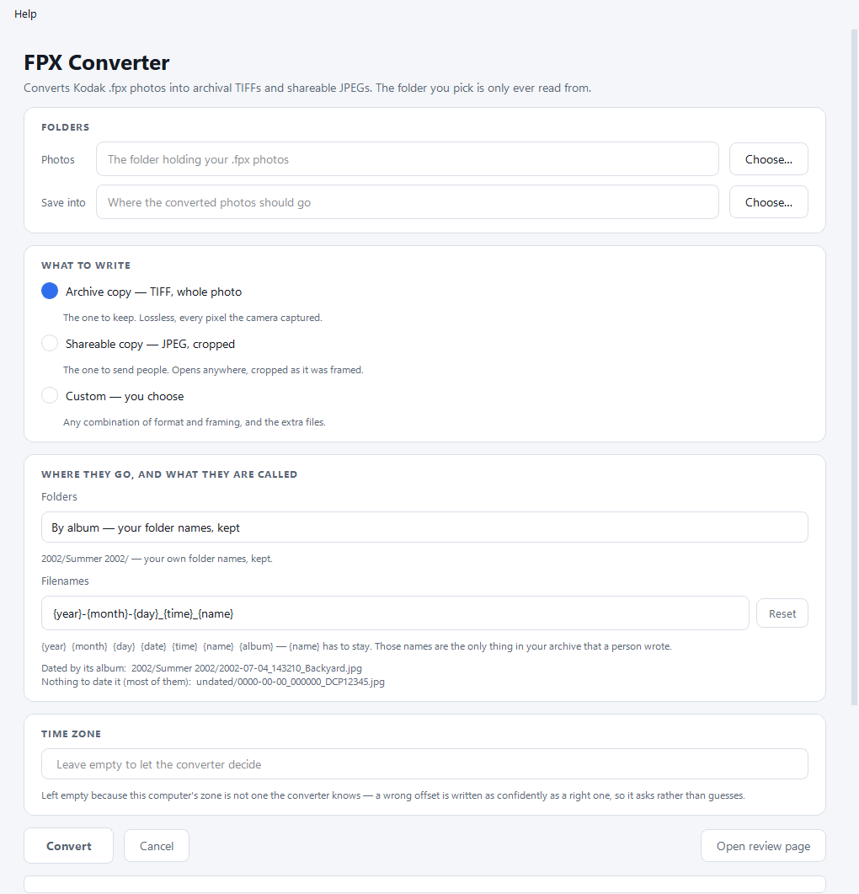
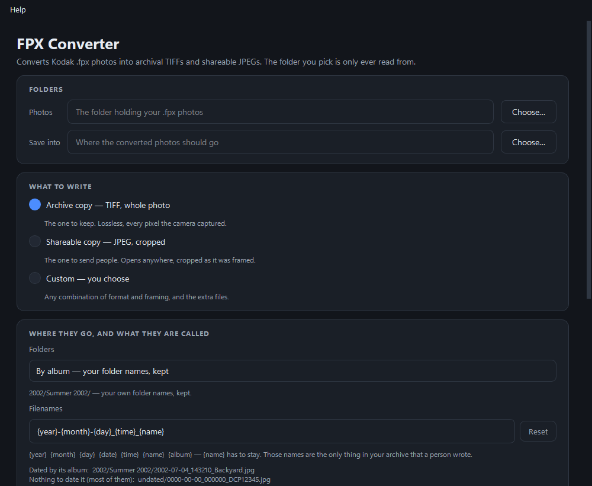
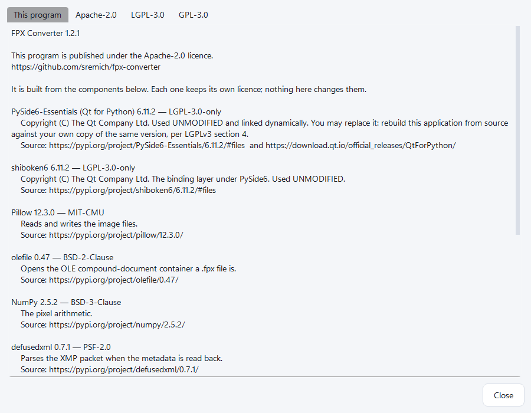

# Using FPX Converter

A complete walkthrough of the desktop application, written for somebody who
does not use a terminal and has never heard of EXIF. If something goes wrong,
[TROUBLESHOOTING.md](TROUBLESHOOTING.md) is the companion to this page.

The one thing to know before you start: **your original photos are never
changed.** The folder you point the app at is only ever read from. Nothing in
it is written, moved, renamed or deleted, and if you try to save the converted
photos inside it, the app refuses and says why.

---

## 1. Download the app

Go to
[the latest release](https://github.com/sremich/fpx-converter/releases/latest)
and download `fpx-converter-<version>.exe`. That single file is the whole
application. There is no installer and no Python to set up.

Windows only. There is no Mac or Linux version of the window.

## 2. Getting past the Windows warnings

The app is **not code-signed**. A code-signing certificate is an annual expense
and this is a free tool, so it ships without one — which means Windows treats
it as a program it has never seen before. You will meet up to three warnings.
All of them are expected. None of them says anything is wrong with the file.

**First, your browser.** Chrome and Edge will say the file "isn't commonly
downloaded" and may hide it. Find the download in the browser's downloads list,
click the **…** (three dots) beside it, and choose **Keep** — then **Keep
anyway** if it asks again.

**Second, Windows itself.** Double-clicking the file brings up a blue box
filling the screen:

> **Windows protected your PC**
> Microsoft Defender SmartScreen prevented an unrecognised app from starting.

The only button you can see is **Don't run**. The way through is the small
**More info** link just above it. Click that, and a **Run anyway** button
appears. Click that. You should only have to do this once per downloaded copy.

**Third, possibly your antivirus.** The app is packed into one file with a tool
called PyInstaller, and single-file bundles are a well-known false-positive
trigger for heuristic scanners. If yours quarantines it, that is a guess about
the packaging, not a detection of anything inside. If you would rather not take
anyone's word for it, read the source and build your own copy —
[BUILD.md](BUILD.md) has the steps.

## 3. Install ExifTool (once)

**ExifTool** is a separate free program that writes the descriptive
information — dates, camera name, dimensions — into the converted photographs.
It has its own licence and cannot be bundled inside this app, so it is
installed separately, once.

Press <kbd>Win</kbd>, type `powershell`, press <kbd>Enter</kbd>. In the window
that opens, type this and press <kbd>Enter</kbd>:

```powershell
winget install --id OliverBetz.ExifTool
```

When it finishes, **close that window and open a new one**, then type
`exiftool -ver`. A version number means you are ready. If it says `exiftool` is
not recognised, see
["Every photo failed"](TROUBLESHOOTING.md#the-app-says-every-photo-failed). If
`winget` itself is not recognised — that happens on older Windows 10 — get the
Windows package from [exiftool.org](https://exiftool.org/) instead.

The converter checks for ExifTool **once, before it starts**. If it is missing
you get one clear message and nothing is written, rather than a folder full of
images that all count as failures.

## 4. Choose your folders



At the top, under **Folders**:

- **Photos** — the folder holding your `.fpx` files. The app looks inside
  subfolders too, so pick the top of the collection. Read-only, always.
- **Save into** — where the converted photographs go. Pick an empty folder, or
  a new one. It must not be inside the Photos folder.

Use the **Choose…** buttons, or paste a path in.

The window follows whichever light or dark theme Windows is set to, and
switches with it while it is open:



Two practical notes. Leave plenty of room: converted TIFFs are considerably
larger than the originals. And if the destination is inside OneDrive, Dropbox
or similar, expect the whole result to be uploaded — set the folder to "always
keep on this device" first, or choose somewhere local.

## 5. Choose what to write

Under **What to write**, three choices, and only one at a time:

- **Archive copy — TIFF, whole photo.** The one to keep. Lossless, every pixel
  the camera captured, nothing cropped away. Large files; not every program
  opens TIFF.
- **Shareable copy — JPEG, cropped.** The one to send people. Opens anywhere,
  and where somebody cropped the photograph in the original Kodak software,
  that crop is applied.
- **Custom — you choose.** Reveals two menus: **File type** (TIFF or JPEG) and
  **Framing** (Whole photo, or Cropped as framed). It also offers two extra
  files per photograph, both off by default:
  - *Also keep a copy of the original `.fpx`* — a duplicate of something your
    source folder still holds, untouched. Usually unnecessary.
  - *Also write the raw properties as `.fpx.json`* — everything the file
    carries internally, as text. Useful if you want to inspect what was in
    there; it can be regenerated later at any time.

Whichever you pick, **one image is written per photograph**. Under Custom, the
folder the images land in follows the *framing*, not the name of the mode:
whole-frame images go to `archive/`, cropped ones to `sharing/`. The window
says which, under the menus.

To write both at once — a full-frame TIFF **and** a cropped JPEG in a single
run — use the command line, which keeps the two independent. See
[CLI.md](CLI.md).

## 6. Choose folders and filenames

Under **Where they go, and what they are called**:

**Folders.** By default, *By album* — your own folder names, kept, tucked under
the year. A folder name somebody typed is better evidence than anything the
tool can work out, so it wins. The other choices are *By year*, *By year, then
month*, *All in one folder*, and *Custom*, where you write a pattern such as
`{year}/{album}` with a `/` for each folder level.

**Filenames.** The default is `{year}-{month}-{day}_{time}_{name}`, giving
names like `2002-07-04_143210_Backyard.jpg`. The available fields are `{year}`
`{month}` `{day}` `{date}` `{time}` `{name}` `{album}`, in any arrangement.
**Reset** puts the default back.

`{name}` cannot be left out, and the Convert button stays greyed out until you
put it back. Those names are the only thing in an archive like this that a
person actually wrote — there are no captions or titles anywhere else — so a
pattern without `{name}` throws them away permanently, for every file it
renames. Unlike a wrong date, it cannot be recovered by re-reading the source.

**Watch the two example lines underneath**, which update as you type. The
second one is the important one:

```
Dated by its album:  2002/Summer 2002/2002-07-04_143210_Backyard.jpg
Nothing to date it (most of them):  undated/0000-00-00_000000_DCP12345.jpg
```

Most of these photographs have no trustworthy date anywhere, so most of your
filenames will be mostly zeros. That is the archive being honest, not the
converter failing — and it is much better to find out before six hundred files
than after. [DATES.md](DATES.md) explains why.

## 7. Time zone

One box, and you can usually ignore it. It never shifts a timestamp — the times
stored in these files are already local wall-clock time — it only decides which
UTC offset gets recorded beside them, so a modern photo app can work out the
absolute moment.

Left empty, the converter uses this computer's own time zone. Fill it in (for
example `Europe/London`, `America/Chicago`) if the photographs were taken
somewhere other than where you are converting them. If the box says the
converter could not work out this computer's zone, type one in: it asks rather
than guessing, because a wrong offset is written just as confidently as a right
one.

## 8. Press Convert

You will see a progress bar once the total is known, a running log of what the
converter is doing, and at the end a summary: how many converted, whether
anything failed, and the detail of any problems.

Long runs are fine to leave alone. One bad file never stops the batch — it
becomes a line in the report.

## 9. Cancel is safe

Press **Cancel** and the converter stops after the photograph it is currently
working on, then finishes writing its report. Nothing is corrupted and nothing
is half-written.

Press **Convert** again and it carries on from where it stopped — it remembers
what it has already done and skips it.

Rarely, the converter will not respond to the stop request and has to be killed
outright. You are told so plainly, and it means no report was written *for that
run*. The photographs already converted are still there and are still good.

## 10. Review what you got, and supply the dates you know



Press **Open review page**. A browser opens on a single self-contained page
showing every converted photograph as a thumbnail, filterable by album and by
whether anything went wrong. Failed files are outlined in red.

**Read the confirmation dialog first.** Building this page needs one copy of
each distinct `.fpx` in one flat folder, and the app makes that by copying them
out of your source archive into `<destination>/source-files/`. For a large
collection that can be **gigabytes**. The dialog tells you roughly how much
space it needs before it starts, and you can say no. Your source folder is
still only read from, and the copies are yours to delete once you are done with
the review page.

The page also lists every album that holds an undated photograph, with a date
box beside each one. This is the only route by which a real capture date
enters your archive — somebody who was there is better evidence than a folder
name.

1. Type the dates you know, as `YYYY-MM-DD` — for example `2001-07-04`.
   Leaving a box blank is a perfectly good answer.
2. Scroll to **"Album dates you have supplied"** at the bottom and press
   **Rebuild from the boxes above**. A box fills with text. Select all of it,
   copy it, paste it into a new plain-text file, and save that file as
   **`album-dates.json`** in the folder you chose as **Save into** — beside
   `manifest.json`. Nothing is sent anywhere; the page has no network access.
3. Press **Convert** again. The dates you supplied are written as the real
   capture date for every photograph in those albums. Resume is on, so nothing
   is re-decoded needlessly.

It has to be a **single day**. A month, a year or a season is refused rather
than rounded to the first of something — EXIF has no way to say "sometime in
2001", so writing one would mean inventing a day. See [DATES.md](DATES.md).

## Licences, inside the app

**Help → Licences** shows what this program is built from and under what terms,
in four tabs. It reads those texts out of the application itself, so they
travel with a downloaded copy.

The program is Apache-2.0. The Qt libraries behind the window are LGPL-3.0,
used unmodified and linked dynamically, and the dialog tells you how to rebuild
against your own copy of them if you want to.
